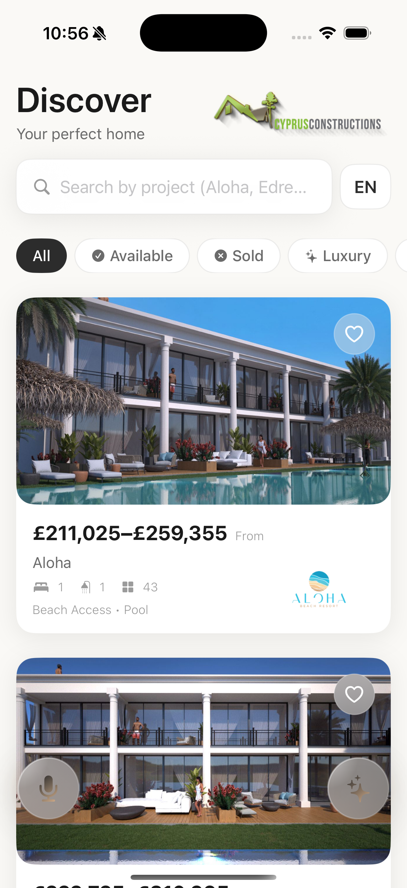
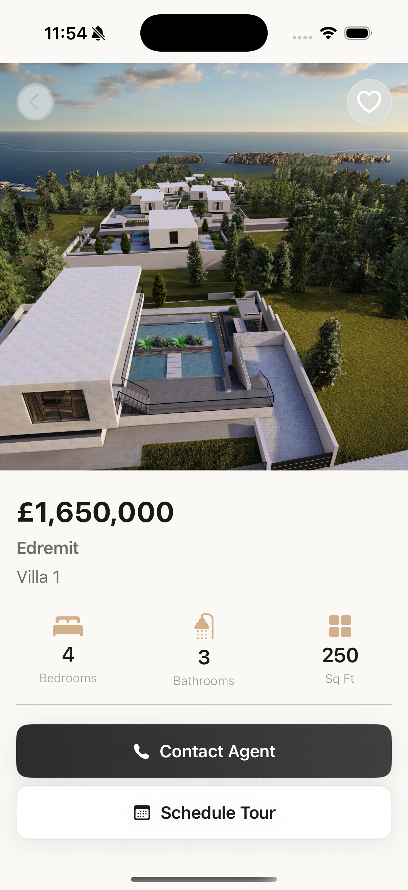
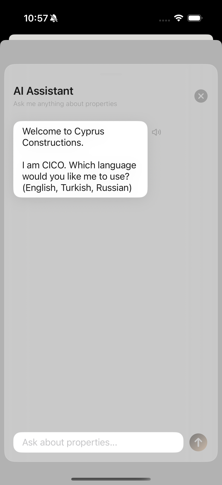
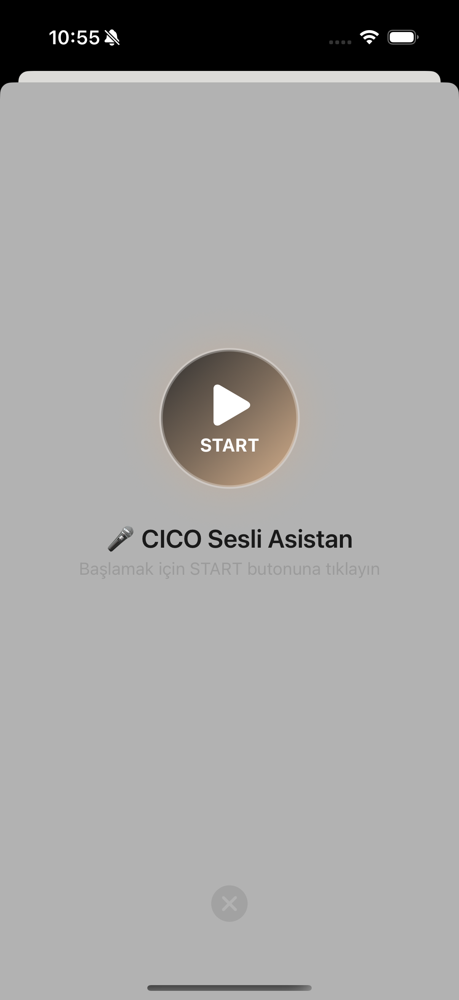

<div align="center">


# CICO AI Real Estate App

**An AI-powered luxury real estate iOS application for Cyprus Constructions**

[](https://swift.org)
[](https://developer.apple.com/xcode/swiftui/)
[](https://ollama.ai)
[](https://flask.palletsprojects.com)
[](https://developer.apple.com)
[](LICENSE)

> *Browse luxury North Cyprus properties and interact with CICO — your personal AI investment sales assistant — via text or voice.*

</div>

---

## Table of Contents

- [Overview](#-overview)
- [Features](#-features)
- [Screenshots](#-screenshots)
- [Architecture](#-architecture)
- [Tech Stack](#-tech-stack)
- [Project Structure](#-project-structure)
- [Prerequisites](#-prerequisites)
- [Setup & Installation](#-setup--installation)
- [Configuration](#-configuration)
- [AI Model — CICO](#-ai-model--cico)
- [Properties](#-properties)
- [Localization](#-localization)
- [Design System](#-design-system)
- [Contributing](#-contributing)

---

## Overview

**hackMobile** is a premium iOS real estate application built for **Cyprus Constructions**, showcasing luxury properties exclusively in **North Cyprus**. The app combines a beautiful Scandinavian minimal design with cutting-edge AI capabilities, allowing potential investors to browse properties and interact with **CICO** — an intelligent AI sales consultant powered by a locally-running Ollama LLM.

Built during a hackathon, this app demonstrates full-stack mobile AI integration: from SwiftUI front-end to a Python Flask backend providing Text-to-Speech and language processing capabilities.

---

## Features

### Property Browsing
- **Pinterest-style grid** layout with lazy loading and image caching
- **Real-time search** across project names, locations, and amenities
- **Multi-criteria filtering**: All · Available · Sold · Luxury (£1M+) · New
- **Full image gallery** with swipeable carousel per property
- Detailed property info: bedrooms, bathrooms, sq ft, price ranges, amenities

### AI Assistant — CICO
- **Text Chat Mode**: Streaming chat with character-by-character AI responses
- **Voice Mode**: Speak naturally — CICO listens, understands, and responds via text-to-speech
- Powered by a locally hosted **Ollama LLM** fine-tuned as a Senior Investment Sales Executive
- Automatic **language detection** (Turkish / English) with language-appropriate responses

### Voice & Speech
- Native **iOS Speech Recognition** (SFSpeechRecognizer) for voice input
- **Edge TTS** (Microsoft) for natural, high-quality AI voice responses
- Real-time microphone feedback with visual state indicators

### Multilingual Support
- Full **Turkish** and **English** localization
- Runtime language switching without app restart
- Language-aware TTS voice selection

### Premium UX
- Scandinavian minimal luxury design system
- Consistent 8-point spacing grid
- Warm sand & dark charcoal color palette
- Soft shadows, rounded cards, and elegant typography
- Forced light mode for premium aesthetic

---

## Screenshots

> *Screenshots taken on iPhone 15 Pro running iOS 17*

<table>
  <tr>
    <td align="center"><b>Home — Property Grid</b></td>
    <td align="center"><b>Property Detail</b></td>
    <td align="center"><b>CICO AI Chat</b></td>
    <td align="center"><b>Voice Assistant</b></td>
  </tr>
  <tr>
    <td></td>
    <td></td>
    <td></td>
    <td></td>
  </tr>
</table>

---

## Architecture

```
┌─────────────────────────────────────────────────────────────┐
│                        iOS App (SwiftUI)                     │
│                                                               │
│  ┌──────────┐  ┌─────────────────┐  ┌──────────────────────┐│
│  │ HomeView │  │PropertyDetailView│  │  AIChatView          ││
│  │ (Grid)   │  │  (Gallery)       │  │  VoiceAssistantView  ││
│  └──────────┘  └─────────────────┘  └──────────────────────┘│
│                                                               │
│  ┌─────────────────────────────────────────────────────────┐ │
│  │                    Services Layer                        │ │
│  │  OllamaService │ TTSService │ SpeechRecognitionService  │ │
│  │  PropertyLoader │ LanguageManager                       │ │
│  └─────────────────────────────────────────────────────────┘ │
└─────────────────────────┬───────────────────────────────────┘
                          │ HTTP
          ┌───────────────┼───────────────┐
          │               │               │
   ┌──────▼──────┐  ┌─────▼─────┐        │
   │  Ollama LLM │  │ Flask API │        │
   │ :11434      │  │ cico_api  │        │
   │ (satis-     │  │ :5001     │        │
   │  danismani) │  │           │        │
   └─────────────┘  └─────┬─────┘        │
                          │              │
                    ┌─────▼──────┐       │
                    │  Edge TTS  │       │
                    │  (MP3 out) │       │
                    └────────────┘       │
```

### Architecture Pattern
- **MVVM** with a dedicated Services layer
- **ObservableObject** / **@Published** for reactive state
- **Combine** for async data flows
- **@MainActor** for thread-safe UI updates
- **Core Data** for local persistence

---

## Tech Stack

| Layer | Technology | Purpose |
|-------|-----------|---------|
| **UI** | SwiftUI | Declarative iOS UI framework |
| **Architecture** | MVVM + Services | Separation of concerns |
| **Reactive** | Combine | State management & async |
| **Persistence** | Core Data | Local data storage |
| **Speech Input** | SFSpeechRecognizer | Native iOS STT |
| **Audio** | AVFoundation | Playback & recording |
| **AI Model** | Ollama (local LLM) | Conversational AI |
| **AI Backend** | Python Flask | REST API bridge |
| **TTS** | Microsoft Edge TTS | Natural voice synthesis |
| **STT (optional)** | faster-whisper | Server-side transcription |
| **Lang Detection** | langdetect | Auto-language detection |
| **Image Loading** | Custom AsyncImageLoader | Cached property images |

---

## Project Structure

```
hackathonMobile/
├── hackMobile/
│   ├── cico_api.py                     # Python Flask backend
│   ├── venv/                           # Python virtual environment
│   │
│   └── hackMobile/                     # iOS Xcode project
│       ├── hackMobileApp.swift         # App entry point
│       │
│       ├── Models/
│       │   └── Property.swift          # Property data model
│       │
│       ├── Views/
│       │   ├── HomeView.swift          # Main listing screen
│       │   ├── PropertyDetailView.swift # Detail + image gallery
│       │   ├── AIChatView.swift        # Text-based AI chat
│       │   └── VoiceAssistantView.swift # Voice AI assistant
│       │
│       ├── Components/
│       │   ├── PropertyCard.swift      # Grid card component
│       │   ├── AsyncImageLoader.swift  # Cached image loading
│       │   ├── SearchBar.swift         # Search input
│       │   ├── FilterPills.swift       # Filter buttons
│       │   ├── FloatingAIAssistantButton.swift
│       │   └── FloatingVoiceAssistantButton.swift
│       │
│       ├── Services/
│       │   ├── OllamaService.swift     # Ollama AI API client
│       │   ├── TTSService.swift        # Text-to-Speech service
│       │   ├── SpeechRecognitionService.swift  # STT service
│       │   ├── PropertyLoader.swift    # Property data loading
│       │   └── LanguageManager.swift   # i18n & language toggle
│       │
│       ├── Theme/
│       │   └── AppTheme.swift          # Design system
│       │
│       ├── evler/                      # Property images & data
│       │   ├── Aloha Beach Resort/
│       │   ├── Edremmit Villas/
│       │   ├── Pearl Island Homes/
│       │   ├── Phuket Health and Wellness resort/
│       │   └── cyprusConstructions/    # Brand assets
│       │
│       └── *.lproj/                    # Localization strings
│           ├── en.lproj/
│           └── tr.lproj/
│
└── README.md
```

---

## Prerequisites

Before running the app, ensure you have:

| Tool | Version | Notes |
|------|---------|-------|
| Xcode | 15.0+ | iOS development |
| iOS Simulator | iOS 16.0+ | Or physical device |
| Python | 3.12+ | For Flask backend |
| [Ollama](https://ollama.ai) | Latest | Local LLM runner |
| macOS | 13.0+ | Ventura or later |

---

## Setup & Installation

### 1. Clone the Repository

```bash
git clone https://github.com/YOUR_USERNAME/hackathonMobile.git
cd hackathonMobile
```

### 2. Set Up Ollama & Create the CICO Model

Install Ollama from [ollama.ai](https://ollama.ai), then create the custom model:

```bash
# Pull a base model (e.g. llama3 or mistral)
ollama pull llama3

# Create CICO model from modelfile
ollama create satis-danismani -f promt.txt

# Verify the model
ollama list
```

Start Ollama with network access (required for real device testing):

```bash
OLLAMA_HOST=0.0.0.0:11434 ollama serve
```

### 3. Set Up Python Backend

```bash
cd hackMobile

# Create virtual environment
python3 -m venv venv
source venv/bin/activate

# Install dependencies
pip install flask flask-cors ollama edge-tts langdetect faster-whisper

# Start the API server
python3 cico_api.py
# → Server running on http://0.0.0.0:5001
```

### 4. Run the iOS App

```bash
# Open in Xcode
open hackMobile/hackMobile.xcodeproj
```

In Xcode:
1. Select your target device (Simulator or real iPhone)
2. Press `Cmd + R` to build and run

---

## Configuration

### For Real Device Testing

When running on a **physical iPhone** (not simulator), update the IP address in two files:

**`hackMobile/hackMobile/Services/OllamaService.swift`** — Line 24:
```swift
private let baseURL = "http://YOUR_MAC_IP:11434"
```

**`hackMobile/hackMobile/Services/TTSService.swift`** — Line 17:
```swift
private let baseURL = "http://YOUR_MAC_IP:5001"
```

> Find your Mac's IP: `System Settings → Wi-Fi → Details → IP Address`

> Both your Mac and iPhone must be on the **same Wi-Fi network**.

### Info.plist Permissions

Ensure these keys are present in `Info.plist`:

```xml
<key>NSMicrophoneUsageDescription</key>
<string>CICO needs your microphone for voice assistant</string>

<key>NSSpeechRecognitionUsageDescription</key>
<string>CICO uses speech recognition to understand your voice</string>
```

---

## AI Model — CICO

**CICO** (Cyprus Investment COnsultant) is a custom-trained Ollama model persona configured as a *Senior Investment Sales Executive* for Cyprus Constructions.

### Capabilities

| Feature | Details |
|---------|---------|
| **Role** | Senior Investment Sales Executive |
| **Knowledge** | All Cyprus Constructions properties |
| **Languages** | Turkish, English, Russian |
| **Style** | Professional, concise, plain text |
| **Interaction** | Text chat + voice |
| **Context** | Full conversation history |

### How It Works

```
User Input (text or voice)
        ↓
  OllamaService.swift
  POST /api/chat → Ollama :11434
  model: "satis-danismani"
        ↓
  AI Response (streaming)
        ↓
  TTSService.swift
  POST /tts → Flask :5001
        ↓
  edge_tts generates MP3
        ↓
  AVAudioPlayer plays audio
```

### Voice Interaction Flow

1. Tap **START** → CICO greets you with a welcome audio
2. Tap **🎤 Microphone** → Recording begins
3. Speak your question
4. Tap microphone again → Speech is transcribed
5. CICO processes and responds via AI
6. Response is **spoken aloud** automatically

---

## Properties

The app showcases **4 luxury development projects** in North Cyprus:

| Project | Units | Price Range | Status |
|---------|-------|-------------|--------|
| **Aloha Beach Resort** | 5 | £180K – £800K | Available |
| **Edremmit Villas** | 14 | £120K – £450K | Mixed |
| **Pearl Island Homes** | 1 | £95K – £180K | Available |
| **Phuket Health & Wellness Resort** | 6 | £200K – £1.2M | Available |

### Property Data Model

```swift
struct Property: Identifiable, Hashable {
    let id: UUID
    let title: String
    let price: Int               // Display price
    let minPrice: Int?           // Range minimum
    let maxPrice: Int?           // Range maximum
    let status: PropertyStatus   // .available / .sold
    let location: String
    let bedrooms: Int
    let bathrooms: Int
    let squareFeet: Int
    let imageURL: String         // Main image
    let images: [String]         // Gallery images
    let amenities: [String]
    let description: String
}
```

---

## Localization

The app supports **Turkish** (default) and **English** with runtime language switching.

| Key | Turkish | English |
|-----|---------|---------|
| App Title | Keşfet | Discover |
| Search Placeholder | Proje veya konum ara... | Search projects or locations... |
| Filter: All | Tümü | All |
| Filter: Luxury | Lüks | Luxury |
| CICO Connecting | CICO'ya bağlanıyor... | Connecting to CICO... |
| Voice Start | Sesli Asistanı Başlat | Start Voice Assistant |

Toggle language from the **TR / EN** button in the top-right corner of the home screen.

---

## Design System

The app uses a **Scandinavian Minimal Luxury** design philosophy:

### Color Palette

| Token | Hex | Usage |
|-------|-----|-------|
| `background` | `#FAF9F6` | Warm white app background |
| `surface` | `#FFFFFF` | Cards and panels |
| `primary` | `#2C2C2C` | Headlines and primary text |
| `accent` | `#D4AF8C` | CTAs and highlights (warm sand) |
| `secondary` | `#8B8B8B` | Supporting text |

### Typography

| Style | Size | Weight |
|-------|------|--------|
| Large Title | 34pt | Semibold |
| Title 1 | 28pt | Semibold |
| Headline | 17pt | Semibold |
| Body | 17pt | Regular |
| Caption | 12pt | Light |

### Spacing (8-pt grid)
`xs: 4` · `sm: 8` · `md: 16` · `lg: 24` · `xl: 32` · `xxl: 48`

---

## Contributing

This project was built during a hackathon. Contributions are welcome!

```bash
# Fork the repo
# Create your feature branch
git checkout -b feature/amazing-feature

# Commit your changes
git commit -m 'Add amazing feature'

# Push and open a Pull Request
git push origin feature/amazing-feature
```

---

<div align="center">

**Built with ❤️ for Cyprus Constructions Hackathon**

*SwiftUI · Ollama · Flask · Edge TTS · North Cyprus Real Estate*

</div>
